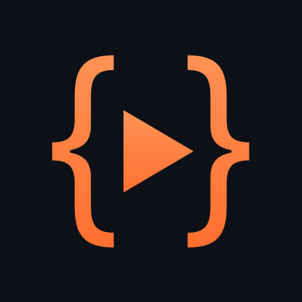
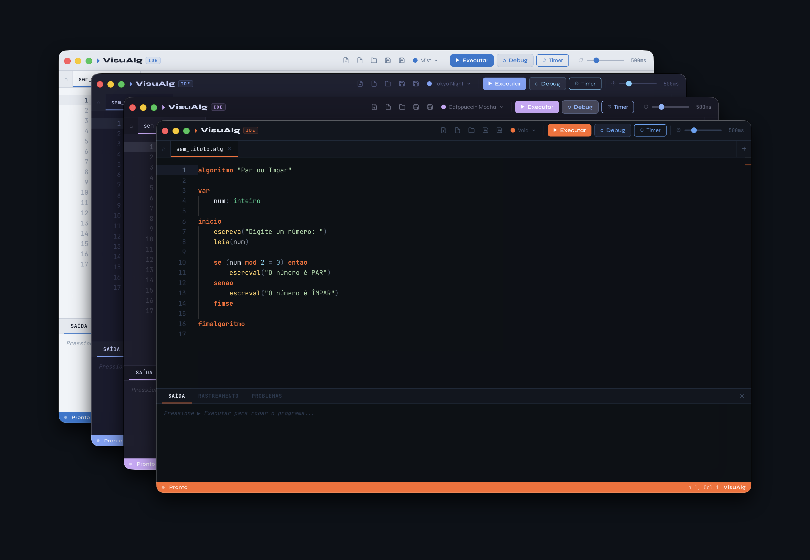
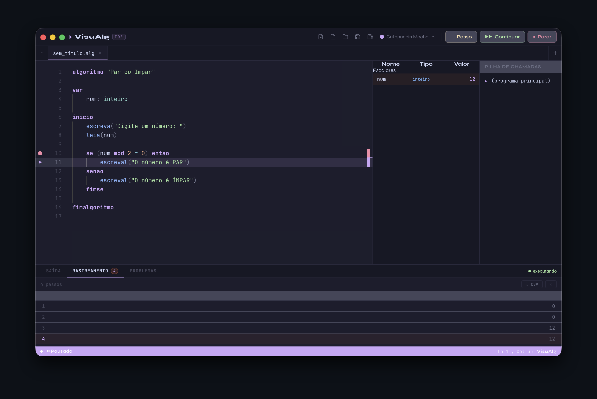

<div align="center">


# VisuAlg IDE

**Uma IDE moderna e poderosa para a linguagem VisuAlg**

[](https://www.gnu.org/licenses/gpl-3.0)
[](https://github.com/the-spanish-guy/visualgcode/releases)
[](https://github.com/the-spanish-guy/visualgcode/actions)

[📥 Download](#-download) • [✨ Features](#-features) • [🚀 Desenvolvimento](#-desenvolvimento) • [🤝 Contribuir](#-contribuir)

</div>

---

## 📖 Sobre

VisuAlg IDE é uma **IDE moderna e multiplataforma** para a linguagem VisuAlg (português estruturado), reconstruída do zero com tecnologias web atuais.

### O que é VisuAlg?

**VisuAlg** (Visualizador de Algoritmos) é um interpretador criado originalmente pelos professores Cláudio Morgado de Souza e Antonio Carlos Nicolodi. Ele permite escrever e executar algoritmos em uma linguagem próxima do **Portugol** — uma pseudo-linguagem algorítmica com comandos em português, ideal para ensino de lógica de programação.

### Por que uma nova IDE?

O VisuAlg original é uma ferramenta muito utilizada no Brasil, presente em livros didáticos e cursos de algoritmos. Porém, tinha limitações:

❌ Disponível apenas para Windows  
❌ Interface ultrapassada  
❌ Recursos de debug limitados  
❌ Sem suporte a workspaces com múltiplos arquivos  

Esta **VisuAlg IDE** traz:

✅ **Multiplataforma** — Windows, Linux e macOS  
✅ **Interface moderna** — Usa o Editor Monaco (mesmo do VS Code)  
✅ **Debug avançado** — Breakpoints, step-by-step, tabela de rastreamento  
✅ **Recursos educacionais** — Explicação de erros em português, autocomplete  
✅ **Open source** — Código aberto sob GPL v3

### 🎯 Público-alvo

- **Estudantes** aprendendo lógica de programação
- **Professores** que ensinam algoritmos
- **Escolas** que usam VisuAlg em suas aulas
- Qualquer pessoa que queira uma IDE moderna para português estruturado

---

## ✨ Features

- Tema dark
- Múltiplas abas
- Syntax highlighting
- Explorador de arquivos
- Salvar/abrir arquivos `.alg`
- Sugestões de variáveis declaradas
- Atalhos de teclado (F5, F9, F10, Ctrl+S, etc.)
- Snippets de estruturas — `se`, `para`, `enquanto`, etc.
- Debug com atalhos, tabela de reastreamento e highlitht de linha atual
- Explicação de erros em português com mensagens amigáveis para iniciantes

---

## 📸 Screenshots

<!-- TODO: Adicionar screenshots -->

<div align="center">

### Interface Principal


### Debug em Ação


### Tabela de Rastreamento


</div>

---

## 📥 Download

### Instaladores Oficiais

Baixe a versão mais recente em [Releases](https://github.com/the-spanish-guy/visualgcode/releases):

| Plataforma | Download | Tipo |
|------------|----------|------|
| **Windows** | `VisuAlg-IDE-Setup-x.x.x.exe` | Instalador |
| **Windows** | `VisuAlg-IDE-Portable-x.x.x.exe` | Portátil (sem instalação) |
| **Linux** | `VisuAlg-IDE-x.x.x.AppImage` | AppImage |
| **macOS** | `VisuAlg-IDE-x.x.x.dmg` | DMG |

### Instalação

#### Windows
1. Baixe o instalador `.exe`
2. Execute (pode aparecer aviso do Windows Defender — clique em "Mais informações" → "Executar mesmo assim")
3. Siga o assistente de instalação

#### Linux
```bash
# Dê permissão de execução
chmod +x VisuAlg-IDE-*.AppImage

# Execute
./VisuAlg-IDE-*.AppImage
```

#### macOS
1. Abra o arquivo `.dmg`
2. Arraste o app para a pasta Aplicativos
3. Na primeira execução, vá em Preferências do Sistema → Segurança e clique em "Abrir mesmo assim"

---

## 🚀 Desenvolvimento

### Pré-requisitos

- Node.js 20+
- npm ou yarn
- Git

### Setup Local

```bash
# Clone o repositório
git clone https://github.com/the-spanish-guy/visualgcode.git
cd visualgcode

# Instale as dependências
npm install

# Rode em modo desenvolvimento
npm run dev
```

A IDE abrirá automaticamente em modo hot-reload — qualquer mudança no código recarrega instantaneamente.

### Estrutura do Projeto

```
visualgcode/
├── src/
│   ├── main/              # Processo principal do Electron
│   │   ├── main.ts        # Entry point, window management
│   │   └── preload.ts     # Bridge segura entre main e renderer
│   ├── renderer/          # Interface React
│   │   ├── components/    # Componentes UI
│   │   ├── styles/        # CSS Modules
│   │   ├── App.tsx        # Componente raiz
│   │   └── main.tsx       # Entry point React
│   ├── interpreter/       # Engine do VisuAlg
│   │   ├── Lexer.ts       # Análise léxica
│   │   ├── Parser.ts      # Análise sintática
│   │   └── Evaluator.ts   # Execução e runtime
│   └── typings/           # Declarações TypeScript
├── dist/                  # Build output
├── release/               # Instaladores gerados
└── .github/workflows/     # CI/CD automático
```

---

## 🤝 Contribuir

Este é um projeto open source então contribuições são **muito bem-vindas**!

### Como Contribuir

1. **Fork** o repositório
2. Crie uma **branch** para sua feature (`git checkout -b feature/MinhaFeature`)
3. **Commit** suas mudanças (`git commit -m 'Add: Minha nova feature'`)
4. **Push** para a branch (`git push origin feature/MinhaFeature`)
5. Abra um **Pull Request**

### Diretrizes

- Formae o código antes de abrir a PR (`npm run lint && npm run format`)
- Teste suas mudanças antes de abrir PR
- Descreva claramente o que foi feito no PR

### Reportar Bugs

Encontrou um bug? [Abra uma issue](https://github.com/the-spanish-guy/visualgcode/issues/new) com:
- Descrição clara do problema
- Passos para reproduzir
- Comportamento esperado vs. atual
- Screenshots (se aplicável)
- Versão da IDE e sistema operacional

---

## 📄 Licença

Este projeto está licenciado sob a **GNU General Public License v3.0** — veja o arquivo [LICENSE](LICENSE) para detalhes.

---

Feito por [the spanish guy](https://github.com/the-spanish-guy) com 🖤

```
          ／＞　 フ
         | 　_　_|
       ／` ミ__^ノ
      /　　　　 |
     /　 ヽ　　 ﾉ           ╱|、
    /　　 |　|　|         (˚ˎ 。7
／￣|　　 |　|　|          |、˜〵
(￣ヽ＿_  ヽ_)__)         じしˍ,)ノ
＼二)
```

Se este projeto te ajudou, considere dar uma ⭐ no repositório!