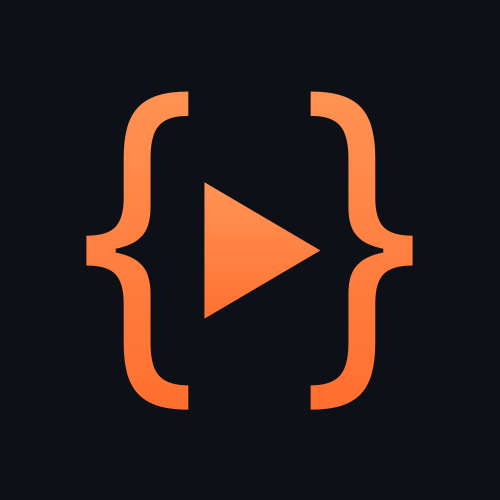
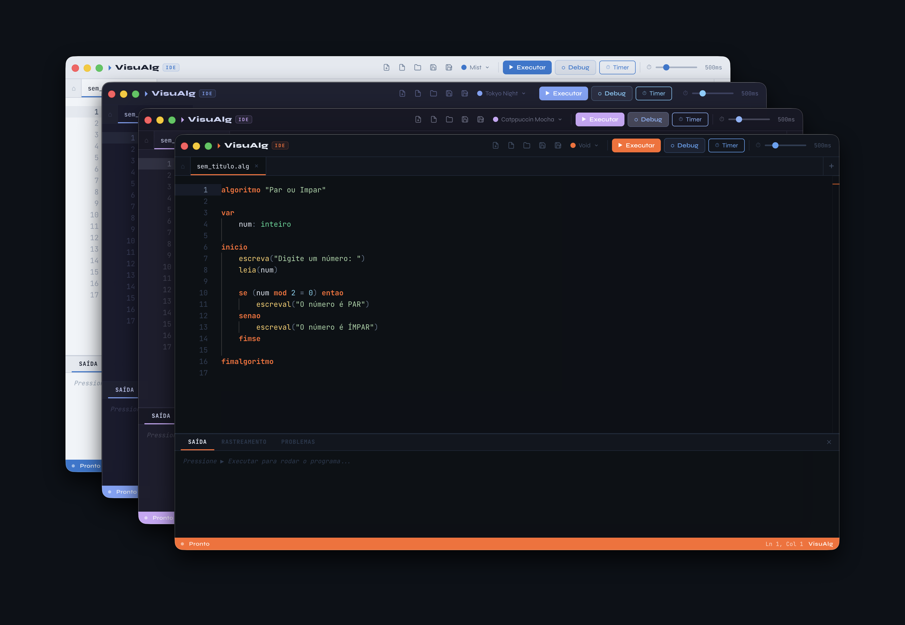
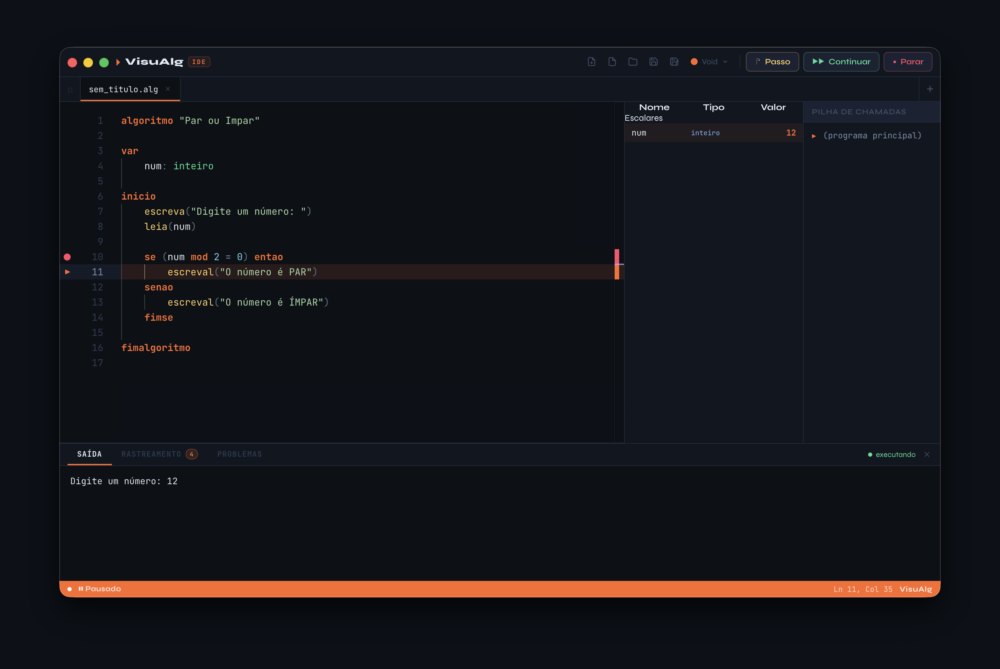
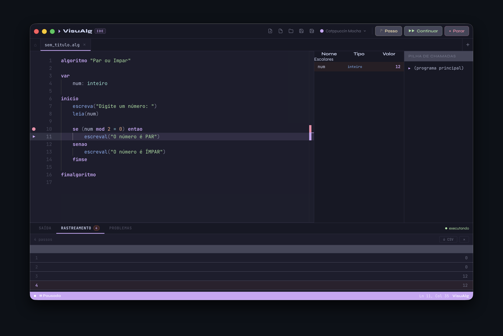

<div align="center">


# VisuAlg IDE

[](https://www.gnu.org/licenses/gpl-3.0)
[](https://github.com/the-spanish-guy/visualgcode/releases)
[](https://github.com/the-spanish-guy/visualgcode/actions)

[Download](#download) • [Desenvolvimento](#desenvolvimento) • [Releases](#criando-uma-release)

</div>

---

VisuAlg é um interpretador criado pelos professores Cláudio Morgado de Souza e Antonio Carlos Nicolodi para ensino de lógica de programação em português estruturado (Portugol). O original funciona só no Windows e está abandonado há anos.

Esta IDE reimplementa o interpretador do zero e traz uma interface moderna com Monaco Editor, debug com breakpoints, múltiplas abas e suporte a Windows, Linux e macOS.

---

## Features

- Múltiplas abas
- Syntax highlighting
- Explorador de arquivos e workspaces
- Autocomplete de variáveis e funções declaradas
- Snippets — `se`, `para`, `enquanto`, etc.
- Atalhos de teclado — F5, F9, F10, Ctrl+S, etc.
- Debug com breakpoints, step-by-step e tabela de rastreamento
- Mensagens de erro em português com explicações para iniciantes
- Temas — Void, Mist, Dracula, Nord, Tokyo Night, Catppuccin

---

## Screenshots

<div align="center">







</div>

---

## Download

Baixe a versão mais recente em [Releases](https://github.com/the-spanish-guy/visualgcode/releases):

| Plataforma | Arquivo | Tipo |
|------------|---------|------|
| Windows | `VisuAlg-IDE-Setup-x.x.x.exe` | Instalador |
| Windows | `VisuAlg-IDE-Portable-x.x.x.exe` | Portátil |
| Linux | `VisuAlg-IDE-x.x.x.AppImage` | AppImage |
| macOS | `VisuAlg-IDE-x.x.x.dmg` | DMG |

**Windows** — pode aparecer aviso do Defender, clique em "Mais informações" → "Executar mesmo assim".

**Linux:**
```bash
chmod +x VisuAlg-IDE-*.AppImage
./VisuAlg-IDE-*.AppImage
```

**macOS** — na primeira execução, vá em Configurações do Sistema → Privacidade e Segurança e clique em "Abrir mesmo assim".

---

## Desenvolvimento

**Pré-requisitos:** Node.js 20+

```bash
git clone https://github.com/the-spanish-guy/visualgcode.git
cd visualgcode
npm install
npm run dev
```

**Comandos úteis:**

```bash
npm run build        # build completo
npm test             # roda os testes
npm run check        # lint + format
```

### Estrutura

```
src/
├── main/           # Processo principal Electron (window, IPC, file system)
├── renderer/       # Interface React
│   ├── components/ # Toolbar, TabBar, StatusBar, ThemeSelector
│   ├── panels/     # Editor (Monaco), Terminal, Explorer
│   ├── store/      # Estado global (Zustand)
│   └── themes/     # Definições de tema
└── interpreter/    # Engine VisuAlg — Lexer → Parser → Evaluator
```

---

## Criando uma Release

```bash
git tag -a vX.Y.Z -m "vX.Y.Z"
git push origin main vX.Y.Z
```

O CI compila os instaladores para Windows, Linux e macOS, atualiza o `CHANGELOG.md` e publica a release automaticamente.

---

## Contribuindo

PRs são bem-vindos. Rode `npm run check` antes de abrir.

Bugs? [Abra uma issue](https://github.com/the-spanish-guy/visualgcode/issues/new) descrevendo o problema, como reproduzir e qual SO/versão você está usando.

---

Feito por [the spanish guy](https://github.com/the-spanish-guy) com 🖤

```
          ／＞　 フ
         | 　_　_|
       ／` ミ__^ノ
      /　　　　 |
     /　 ヽ　　 ﾉ           ╱|、
    /　　 |　|　|         (˚ˎ 。7
／￣|　　 |　|　|          |、˜〵
(￣ヽ＿_  ヽ_)__)         じしˍ,)ノ
＼二)
```

Se este projeto te ajudou, considera dar uma ⭐
